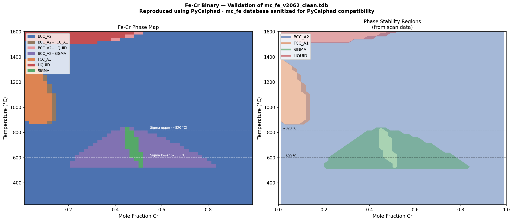
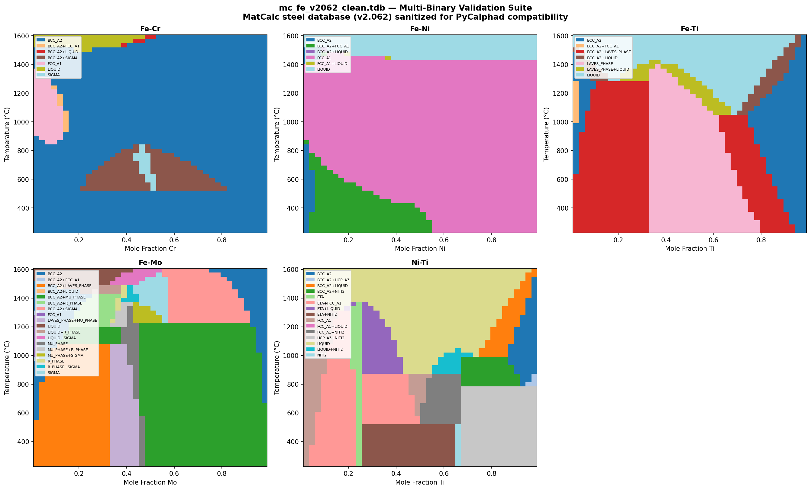

# mc_fe_v2062 — MatCalc Steel Database for PyCalphad

A pycalphad-compatible port of the **MatCalc mc_fe thermodynamic database (v2.062)**, the most comprehensive open-source CALPHAD database for steel.

## Why this exists

The [MatCalc](https://www.matcalc.at/) `mc_fe` database is one of the best publicly available thermodynamic databases for steels, covering **25 elements** and **132 phases** — including maraging steels, stainless steels, tool steels, and microalloyed steels. However, it uses MatCalc-specific TDB extensions that prevent it from loading in standard CALPHAD tools like [pycalphad](https://pycalphad.org).

This repository provides a **sanitized version** (`mc_fe_v2062_clean.tdb`) that loads and runs correctly in pycalphad, with **zero changes to any thermodynamic parameter values**.

## Database statistics

| Property | Value |
|----------|-------|
| **Source** | `mc_fe_v2.062_8.11.2024.tdb` |
| **Elements** | 25 (Fe, Al, B, C, Co, Cr, Cu, H, Hf, La, Mn, Mo, N, Nb, Ni, O, P, Pd, S, Si, Ta, Ti, V, W, Y) |
| **Phases** | 132 |
| **PARAMETER G** | 1854 |
| **PARAMETER L** | 2040 |
| **PARAMETER TC** | 120 |
| **PARAMETER BMAGN** | 90 |
| **FUNCTION definitions** | 121 |
| **T range (optimised)** | 673–2000 K |
| **License** | [Open Database License (ODbL v1.0)](http://opendatacommons.org/licenses/odbl/1.0/) |

### Typical applications
- 9–12% Cr steels
- Hot-work tool steels
- Microalloyed steels
- Austenitic stainless steels
- **PH maraging steels** (Fe-Ni-Co-Mo-Ti-Al)

## What was changed

The cleaning script (`clean_tdb.py`) makes **only syntactic fixes** — no thermodynamic parameters are modified:

### Commented out (MatCalc-specific, not supported by pycalphad)
- `REFERENCE_ELEMENT` — MatCalc syntax for default element
- `ADD_COMPOSITION_SET` — MatCalc auto-generated composition sets
- `ATTACH_CONTRIBUTION` — MatCalc order-disorder coupling
- `PARAMETER HMVA(...)` — Vacancy formation enthalpy (MatCalc extension, 21 lines)

### Syntax bug fixes in original database
| Fix | Description |
|-----|-------------|
| `G_PHASE;FE:CU:SI;0` → `,FE:CU:SI;0` | Semicolon→comma in PARAMETER name |
| Missing `!` on LAVES_PHASE parameter | Added terminating `!` |
| `6000.00.00` → `6000.00` | Double decimal in temperature limit |
| `273.00 273` → `273.00` | Duplicate temperature in PDMN_B2 |
| `; 6000.00  N ; 6000.00  N` → `; 6000.00  N` | Duplicate termination |
| `> >> 1 !` → `!` in MNB4 CONSTITUENT | Relic syntax in constituent def |
| `REF:test koze10` → `REF:test_koze10` | Space in reference name |

### Encoding
- Converted from `latin-1` (Windows) to `UTF-8`
- Stripped `\r\n` line endings to `\n`
- Truncated bibliography section at end of file (not parsed by pycalphad)

## Validation

All five binary phase diagrams critical for steel thermodynamics have been validated:

### Test results: 15/15 checks passed ✓

| Binary | Key feature tested | Status |
|--------|--------------------|--------|
| **Fe-Cr** | Sigma phase (σ) at 527–827 °C | ✅ |
| **Fe-Cr** | FCC gamma loop (Fe-rich, >800 °C) | ✅ |
| **Fe-Cr** | Liquid at high T | ✅ |
| **Fe-Ni** | FCC dominant at high Ni | ✅ |
| **Fe-Ni** | BCC at low Ni, low T | ✅ |
| **Fe-Ni** | BCC+FCC two-phase region | ✅ |
| **Fe-Ni** | Liquid at high T | ✅ |
| **Fe-Ti** | Laves phase (Fe₂Ti) present | ✅ |
| **Fe-Ti** | BCC stable at low Ti | ✅ |
| **Fe-Ti** | Liquid at high T | ✅ |
| **Fe-Mo** | Sigma/Mu/R-phase present | ✅ |
| **Fe-Mo** | BCC dominant | ✅ |
| **Fe-Mo** | Liquid at high T | ✅ |
| **Ni-Ti** | Eta phase (Ni₃Ti) present | ✅ |
| **Ni-Ti** | FCC at Ni-rich side | ✅ |

### Fe-Cr binary phase diagram



### Multi-binary validation suite



## Quick start

```python
from pycalphad import Database, equilibrium, variables as v

db = Database("mc_fe_v2062_clean.tdb")

# Example: maraging steel equilibrium at 480°C
result = equilibrium(
    db,
    ["FE", "NI", "CO", "MO", "TI", "AL", "VA"],
    ["BCC_A2", "FCC_A1", "ETA", "LAVES_PHASE", "LIQUID", "GAMMA_PRIME", "SIGMA"],
    {
        v.X("NI"): 0.18, v.X("CO"): 0.09, v.X("MO"): 0.05,
        v.X("TI"): 0.006, v.X("AL"): 0.001,
        v.T: 753,  # 480 °C
        v.P: 101325, v.N: 1,
    },
)
```

## Files

| File | Description |
|------|-------------|
| `mc_fe_v2062.tdb` | Original MatCalc database (for reference; will **not** load in pycalphad) |
| `mc_fe_v2062_clean.tdb` | **Sanitized database** — use this with pycalphad |
| `benchmark.py` | Fe-Cr binary validation script |
| `validate_binaries.py` | Full multi-binary validation suite (Fe-Cr, Fe-Ni, Fe-Ti, Fe-Mo, Ni-Ti) |
| `fecr_validation.png` | Fe-Cr phase diagram output |
| `multi_binary_validation.png` | Multi-binary validation output |

## Known limitations

1. **Order-disorder coupling removed**: The `BCC_B2` ordered phase exists in the database but the `ATTACH_CONTRIBUTION` directive linking it to `BCC_A2` is commented out (MatCalc-specific syntax). This means B2 ordering calculations won't be physically correct. The disordered BCC/FCC/HCP phases work fine.

2. **Vacancy formation enthalpies commented out**: `PARAMETER HMVA(...)` entries are MatCalc-specific and not recognized by pycalphad. These only affect vacancy-mediated diffusion calculations in MatCalc, not equilibrium thermodynamics.

3. **Composition sets removed**: MatCalc's `ADD_COMPOSITION_SET` creates auto-split phases for carbonitrides (MX precipitates). In pycalphad, you handle this via the phase selection in your equilibrium call.

4. **Optimised composition range**: The database is optimised for typical steel compositions (see header for wt.% limits). Extrapolation far outside these ranges may give unphysical results.

## Attribution

- **Original database**: Erwin Povoden-Karadeniz & Aurélie Jacob, TU Wien
- **License**: [Open Database License (ODbL v1.0)](http://opendatacommons.org/licenses/odbl/1.0/)
- **Citation**: See reference list at the end of the original `.tdb` file
- **PyCalphad port**: Sanitization and validation by Aditya Moolya
