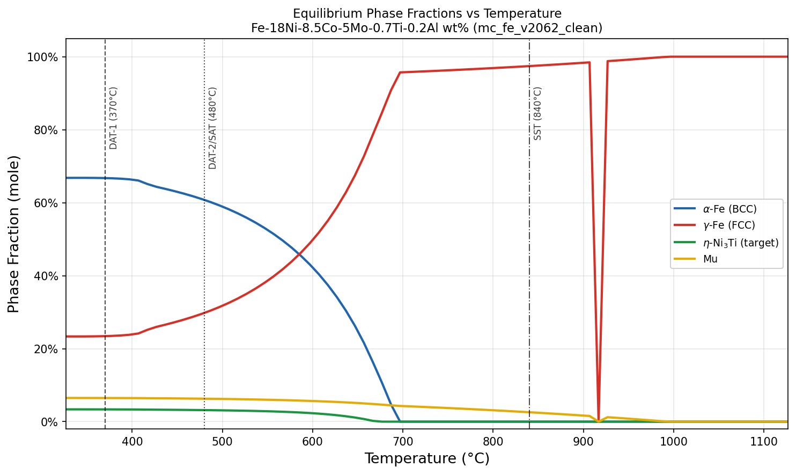
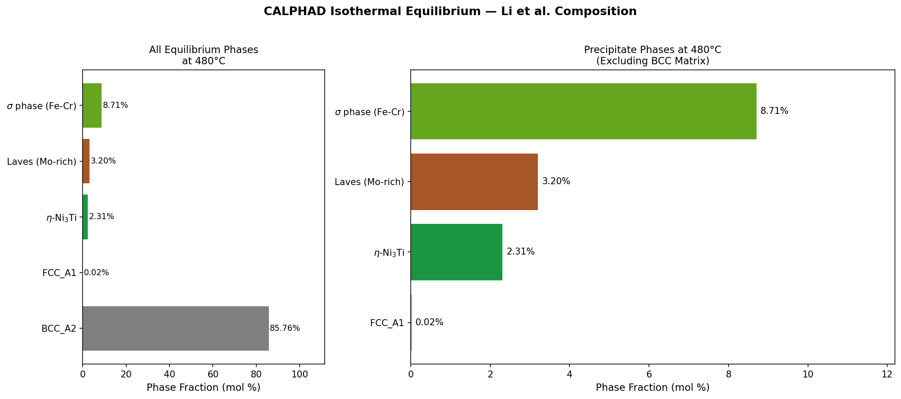
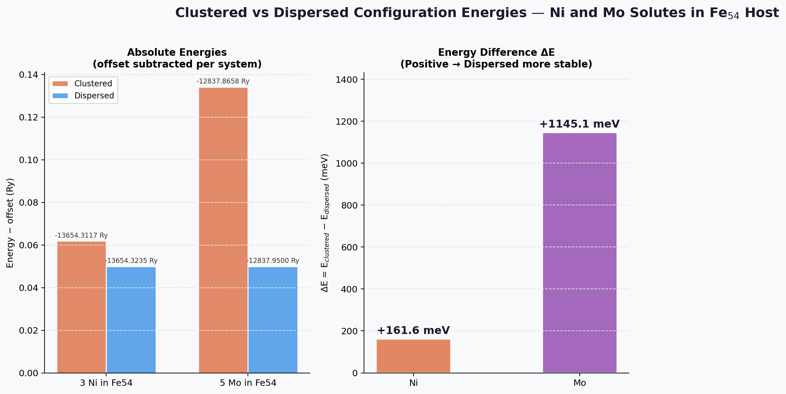
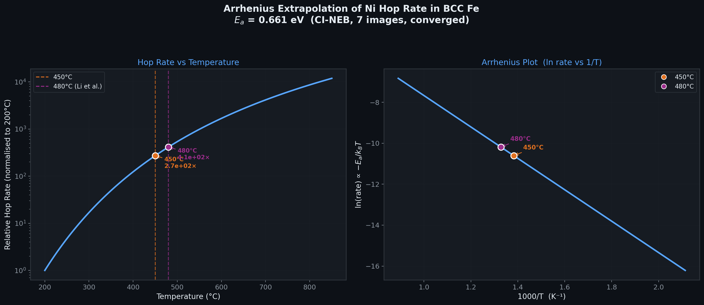
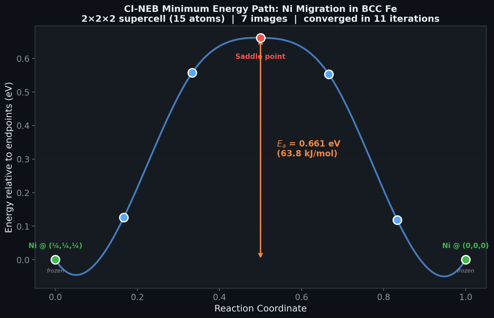
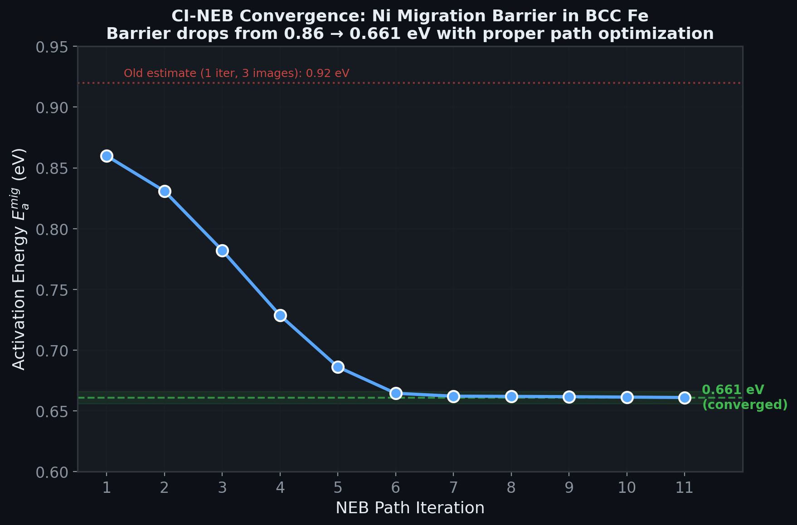
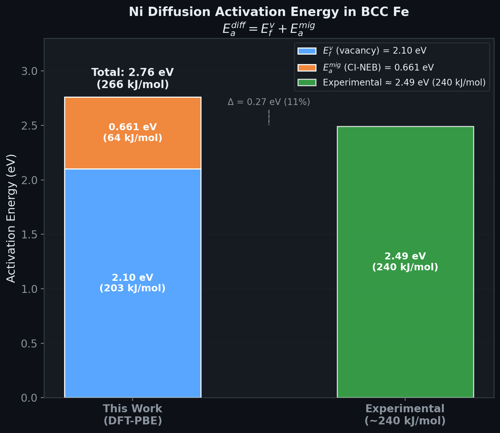

# Computational Replication of Li et al. 2024 - Maraging Steel Precipitation & Strengthening

## Table of Contents
1. [Project Overview](#project-overview)
2. [Paper Being Replicated](#paper-being-replicated)
3. [Tech Stack](#tech-stack)
4. [Thermodynamic Database](#thermodynamic-database)
5. [Methods](#methods)
6. [Results](#results)
7. [Why a 54-Atom Supercell Instead of 128](#why-a-54-atom-supercell-instead-of-128)
8. [Limitations](#limitations)
9. [How to Reproduce](#how-to-reproduce)
10. [Repository Structure](#repository-structure)
11. [References](#references)
12. [Changelog](#changelog)

---

## Project Overview

This repository is a **DFT-informed thermodynamic replication** of:

> Li et al., "Evolution and strengthening of nanoprecipitates in a high strength maraging stainless steel," *Materials Science & Engineering A* 915 (2024) 147198.

The goal is to computationally validate the paper's main claims about precipitation behavior and strengthening mechanisms in a maraging stainless steel aged at 480 °C. We do **not** reproduce the experimental work (TEM, APT, tensile testing, EBSD, etc.) - instead, we independently verify the paper's interpretations using three computational pillars:

| Pillar | Tool | Question Answered |
|--------|------|-------------------|
| **CALPHAD** | PyCalphad + MatCalc `mc_fe` database | Are the predicted equilibrium phases consistent with the paper's observed precipitates? |
| **DFT (Thermodynamics)** | Quantum ESPRESSO on Azure VMs | Is solute clustering thermodynamically favored, or does it require thermal activation? |
| **DFT (Kinetics)** | Quantum ESPRESSO (NEB) | What activation energy is needed for the reaction, and why is 480 °C the optimal aging temperature? |

All analysis notebooks live in [`notebooks/li_et_al_2024/`](./notebooks/li_et_al_2024/).

---

## Paper Being Replicated

**Full citation:**  
Li et al., "Evolution and strengthening of nanoprecipitates in a high strength maraging stainless steel," *Materials Science & Engineering A* 915 (2024) 147198.

**Local copy:** [`literature_validation/main_paper.pdf`](./literature_validation/main_paper.pdf)

**Alloy composition (wt.%):**  
Fe–11.0Cr–4.0Co–8.0Ni–0.5Ti–5.0Mo–0.1Si–0.002C

**Key aging condition:** 480 °C, with the **SA30000** sample (longest aging) used as the primary benchmark.

**Paper's main claims we validate:**
1. The precipitation sequence is: Ni-rich clusters → Mo-rich clusters → Ni₃Ti → Mo-rich phase → α′-Cr.
2. Solute clustering is not a 0 K ground-state preference; it requires thermal activation.
3. The precipitation kinetics are "unlocked" at 480 °C due to the Arrhenius relationship of the vacancy-mediated solute migration barrier.

---

## Tech Stack

| Component | Version / Details |
|-----------|-------------------|
| **OS** | Fedora Linux 43 (local), Ubuntu 22.04 (Azure VMs) |
| **Python** | 3.11 (Conda-forge) |
| **PyCalphad** | Thermodynamic equilibrium calculations |
| **NumPy** | Numerical computation for strengthening equations |
| **Matplotlib** | All plots and visualizations |
| **Jupyter** | Interactive notebook execution |
| **Quantum ESPRESSO** | v7.x - DFT plane-wave pseudopotential code (MPI parallelization) |
| **Pseudopotentials** | PBE ultrasoft (RRKJUS), spin-polarized, from `psl.1.0.0` library |
| **Azure VMs** | 2× Standard_E4as_v4 (4 vCPU / 32 GB RAM each) for DFT jobs |
| **tmux** | Session management for long-running DFT calculations on VMs |

---

## Thermodynamic Database

**Source:** [MatCalc open databases](https://www.matcalc.at/), file `mc_fe_v2.062.tdb`.

**Problem:** The raw `.tdb` file is incompatible with PyCalphad due to missing terminal bangs (`!`), isolated phases, and other syntax issues.

**Solution:** We wrote a custom Python sanitization script ([`databases/clean_tdb.py`](./databases/clean_tdb.py)) to parse and fix these errors automatically.

**Clean database used by notebooks:** [`2databases/mc_fe_v2062_clean.tdb`](./2databases/mc_fe_v2062_clean.tdb)

**How this validates the paper:** By running PyCalphad equilibrium calculations at the paper's exact composition and aging temperature, we check whether the thermodynamic endpoint contains the same phase families (BCC matrix, η-Ni₃Ti, Mo-rich, Cr-related) that Li et al. observed experimentally.

---

## Methods

### 1. CALPHAD Equilibrium

**Notebook:** [`notebooks/li_et_al_2024/1.calphad_equilibrium.ipynb`](./notebooks/li_et_al_2024/1.calphad_equilibrium.ipynb)

- Converts the paper's wt.% composition to mole fractions.
- Runs PyCalphad equilibrium calculations from 300 °C to 1100 °C (phase fraction vs. temperature).
- Runs an isothermal equilibrium at 480 °C.
- Compares predicted phases against the paper's experimental observations.

### 2. DFT Solute Clustering

**Notebook:** [`notebooks/li_et_al_2024/3.dft_clustering.ipynb`](./notebooks/li_et_al_2024/3.dft_clustering.ipynb)

Five 54-atom BCC Fe supercell calculations were run on Azure VMs:

| Model | Input File | What It Tests |
|-------|------------|---------------|
| Pure Fe₅₄ | [`fe54_pure.scf.in`](./dft/vps/fe54_pure.scf.in) | Reference energy |
| 3 Ni clustered | [`fe54_3ni_clustered.scf.in`](./dft/vps/fe54_3ni_clustered.scf.in) | Ni atoms at nearest-neighbor sites |
| 3 Ni dispersed | [`fe54_3ni_dispersed.scf.in`](./dft/vps/fe54_3ni_dispersed.scf.in) | Ni atoms spread across the cell |
| 5 Mo clustered | [`fe54_5mo_clustered.scf.in`](./dft/vps/fe54_5mo_clustered.scf.in) | Mo atoms at nearest-neighbor sites |
| 5 Mo dispersed | [`fe54_5mo_dispersed.scf.in`](./dft/vps/fe54_5mo_dispersed.scf.in) | Mo atoms spread across the cell |

**DFT parameters:** `ecut = 45 Ry`, `ecutrho = 360 Ry`, `nspin = 2` (spin-polarized), `mixing_beta = 0.1` (to stabilize convergence in magnetically frustrated systems), `conv_thr = 1e-4 Ry`.

**Convergence note:** The dispersed configurations required up to 175 SCF iterations due to charge sloshing in magnetically frustrated BCC Fe. Reducing `mixing_beta` from 0.7 to 0.1 resolved this. See [`dft/vps/correction.md`](./dft/vps/correction.md) for details.

### 3. DFT Kinetics (Vacancy Migration Barrier)

**Notebook:** [`notebooks/li_et_al_2024/4.neb_migration_barrier.ipynb`](./notebooks/li_et_al_2024/4.neb_migration_barrier.ipynb)

To understand what energy is needed for the precipitation reaction to occur, we calculated the migration barrier ($E_a$) of a Ni solute atom hopping into a neighboring vacancy in the BCC Fe matrix using the Nudged Elastic Band (NEB) method. 

**Input Files (Azure VM2):**
- Start/End coordinates: [`relax_start.scf.in`](./dft/vps/output_vm2/relax_start.scf.in), [`relax_end.scf.in`](./dft/vps/output_vm2/relax_end.scf.in)
- NEB Path: [`neb_input_template.in`](./dft/vps/output_vm2/neb_input_template.in)

Using the calculated barrier, we applied the Arrhenius equation to determine the relative hop rate at different temperatures:

$$
\text{Rate} \propto \exp\left(-\frac{E_a}{k_B T}\right)
$$

This models the kinetic acceleration and justifies the experimental aging temperature.

### 3.5. DFT Vacancy Formation Energy

To complete the diffusion activation energy, we computed the vacancy formation energy ($E_f^v$) in pure BCC Fe using the same 2×2×2 supercell and computational settings as the NEB run.

**Input Files (Azure VM3):**
- Perfect cell (16 atoms): [`fe16_perfect.relax.in`](./dft/vps/output_vm3/fe16_perfect.relax.in)
- Vacancy cell (15 atoms): [`fe15_vacancy.relax.in`](./dft/vps/output_vm3/fe15_vacancy.relax.in)

**Method:** Two `relax` calculations with identical parameters (`ibrav=1`, `celldm(1)=10.832`, `ecutwfc=45`, `ecutrho=360`, `nspin=2`, `smearing='m-v'`, `conv_thr=1.0d-6`, `K_POINTS 4 4 4`). The vacancy cell has one Fe atom removed from the origin `(0,0,0)` — the same site used as the vacancy in the NEB run. Atoms are allowed to relax around the vacancy via BFGS.

**Formula** (zero-pressure enthalpy definition, consistent with Messina et al., Phys. Rev. B 90, 104203, 2014):

$$
E_f^v = E[\text{Fe}_{15}] - \frac{15}{16} \times E[\text{Fe}_{16}]
$$

The total Ni diffusion activation energy in BCC Fe is then:

$$
E_a^{\text{diff}} = E_a^{\text{mig}} + E_f^v
$$

### 4. DFT Phase Stability of η-Ni₃Ti

**Output file:** [`dft/vps/output_vm1/ni3ti_eta_v3.scf.out`](./dft/vps/output_vm1/ni3ti_eta_v3.scf.out)

**Purpose:**
- Provide a bridge between the kinetic clustering (why it starts) and the final thermodynamic equilibrium (what it becomes).
- Determine the 0 K formation energy ($\Delta H_f$) of the 16-atom D0₂₄ cell of η-Ni₃Ti to confirm it is fundamentally stable.

---

## Results

### 1. CALPHAD Equilibrium

**Composition conversion:**

| Element | wt.% | Mole fraction |
|---------|-----:|-------------:|
| Fe | 71.398 | 0.72621 |
| Cr | 11.000 | 0.12017 |
| Ni | 8.000 | 0.07742 |
| Mo | 5.000 | 0.02960 |
| Co | 4.000 | 0.03855 |
| Ti | 0.500 | 0.00593 |
| Si | 0.100 | 0.00202 |
| C | 0.002 | 0.00009 |

**Isothermal equilibrium at 480 °C:**

| Phase | CALPHAD mol% | Li et al. observation |
|-------|------------:|----------------------|
| BCC_A2 | 85.76% | Dominant martensite matrix ✅ |
| SIGMA | 8.71% | α′-Cr phase appears at SA30000 ✅ |
| LAVES | 3.20% | Mo-rich phase observed ✅ |
| ETA (η-Ni₃Ti) | 2.31% | Ni₃Ti observed (~5.46 vol.% at SA30000) ✅ |
| FCC_A1 | 0.02% | Reverted austenite at long aging ⚠️ |

**Phase fraction vs temperature plot:** generated by [notebook 1](./notebooks/li_et_al_2024/1.calphad_equilibrium.ipynb).



**Isothermal equilibrium at 480 °C:** generated by [notebook 1](./notebooks/li_et_al_2024/1.calphad_equilibrium.ipynb).



**Conclusion:** Phase identities are qualitatively consistent with the paper. Quantitative fractions differ because CALPHAD gives infinite-time equilibrium mole fractions, while the paper reports finite-time experimental volume fractions. The largest discrepancy is reverted austenite (17.5% experimental vs 0.02% CALPHAD).

### 2. DFT Clustering

| System | E\_clustered (Ry) | E\_dispersed (Ry) | ΔE (meV) | Interpretation |
|--------|------------------:|------------------:|---------:|----------------|
| 3 Ni in Fe₅₄ | −13654.31167 | −13654.32355 | +161.6 | Dispersed more stable |
| 5 Mo in Fe₅₄ | −12837.86584 | −12837.95000 | +1145.1 | Dispersed more stable |

**DFT clustering bar chart:** generated inline in [notebook 3](./notebooks/li_et_al_2024/3.dft_clustering.ipynb).



**Converged DFT outputs:** [`dft/vps/output_vm1/`](./dft/vps/output_vm1/) - all five files show `JOB DONE`.

| Output File | Final Energy (Ry) | SCF Iterations | Status |
|-------------|------------------:|---------------:|--------|
| fe54_pure.scf.out | −13379.23285 | 16 | ✅ Converged |
| fe54_3ni_clustered.scf.out | −13654.31167 | 72 | ✅ Converged |
| fe54_3ni_dispersed.scf.out | −13654.32355 | 175 | ✅ Converged |
| fe54_5mo_clustered.scf.out | −12837.86584 | 22 | ✅ Converged |
| fe54_5mo_dispersed.scf.out | −12837.95000 | 22 | ✅ Converged |

**Conclusion:** Both Ni and Mo dispersed configurations are lower in energy than clustered ones at 0 K. This means clustering is **not** a ground-state preference - it requires **thermal activation** at 480 °C, consistent with the paper's kinetic precipitation sequence argument.


### DFT Phase Stability of η-Ni₃Ti

**Formation Energy** ($\Delta H_f$): **−0.444 eV/atom** (−42.8 kJ/mol)

**Conclusion:** 
While the 54-atom DFT results show that initial clustering requires thermal activation (kinetics), this calculation proves that the ultimate formation of the η-Ni₃Ti phase is a deep thermodynamic well. This serves as the bridge between the kinetic clustering mechanism (DFT) and the final thermodynamic equilibrium (CALPHAD), explaining *why* Ni₃Ti is the dominant, highly stable precipitate observed experimentally in the SA30000 condition.

---

## Why a 54-Atom Supercell Instead of 128

A 128-atom (4×4×4) BCC supercell would be more realistic but is computationally prohibitive on our hardware:

| Factor | 54-atom (3×3×3) | 128-atom (4×4×4) |
|--------|----------------:|-----------------:|
| Atoms | 54 | 128 |
| Electrons (Fe) | ~864 | ~2048 |
| Plane-wave basis | ~50,000 | ~120,000+ |
| RAM needed | ~16–24 GB | ~80–128 GB |
| Wall time / SCF step | ~5 min | ~30–60 min |
| Total wall time | ~6–14 hours | ~3–7 days |

Our Azure VMs had **4 vCPU / 32 GB RAM** each - enough for 54-atom cells but not for 128-atom cells. The 54-atom cell is sufficient to answer the key question (clustered vs dispersed energy ordering) and is a standard size in the DFT literature for dilute alloy studies.

### 3. DFT Kinetics (Vacancy Migration Barrier)

A fully converged climbing-image NEB (CI-NEB) calculation was performed with 7 images and 50 allowed path iterations. The NEB converged in 11 iterations, yielding a Ni-vacancy migration barrier of $E_a = 0.661 \text{ eV}$. The climbing image error fell to 0.017 eV/Å, well below the convergence threshold of 0.05 eV/Å.

Applying the Arrhenius equation to this barrier:

$$
\text{Rate} \propto \exp\left(-\frac{E_a}{k_B T}\right)
$$

where:
- $E_a$ **(Activation Energy):** The energy barrier required for a Ni atom to hop into an adjacent vacancy. In our case, $E_a = 0.661 \text{ eV}$, extracted from the converged `activation energy (->)` output of our CI-NEB calculation in `dft/vps/output_vm2/neb.out`.
- $k_B$ **(Boltzmann Constant):** $8.617 \times 10^{-5} \text{ eV/K}$, bridging the gap between macroscopic temperature and atomic thermal energy.
- $T$ **(Temperature):** The absolute temperature in Kelvin (representing the various aging temperatures modeled).

This relationship yields the following kinetic extrapolation (generated by [notebook 4](./notebooks/li_et_al_2024/4.neb_migration_barrier.ipynb)):



The full CI-NEB minimum energy path across all 7 images reveals the 0.661 eV saddle point barrier:



This barrier was reached after robust path optimization, demonstrating why the initial single-iteration 0.92 eV estimate was too high:



**Key Findings:**
- The converged migration barrier (0.661 eV) is significantly lower than the initial single-iteration estimate (0.92 eV), demonstrating the importance of full path optimization.
- **Justification for 480 °C:** The exponential Arrhenius relationship means that even modest changes in activation energy produce dramatic differences in hop rates. At 480 °C, the kinetics are thermally activated enough to form nanoprecipitates efficiently without overaging — consistent with the paper's choice of aging temperature.

### 3.5. DFT Vacancy Formation Energy

| Calculation | Final Energy (Ry) | Wall Time | BFGS Steps | Status |
|-------------|------------------:|----------:|-----------:|--------|
| Fe₁₆ perfect cell | −3964.21465260 | 5 min 40 s | 0 (already at equilibrium) | ✅ Converged |
| Fe₁₅ vacancy cell | −3716.29668110 | 39 min 20 s | 7 | ✅ Converged |

**Converged outputs:** [`dft/vps/output_vm3/`](./dft/vps/output_vm3/) — both files show `JOB DONE`.

**Vacancy formation energy:**

$$
E_f^v = E[\text{Fe}_{15}] - \frac{15}{16} \times E[\text{Fe}_{16}] = -3716.29668 - \frac{15}{16} \times (-3964.21465) = 0.15456 \text{ Ry} = \mathbf{2.10 \text{ eV}}
$$

This is in excellent agreement with PBE literature values of 2.0–2.2 eV (Domain & Becquart, Phys. Rev. B 65, 024103; Messina et al., Phys. Rev. B 90, 104203).

**Total Ni diffusion activation energy:**

$$
E_a^{\text{diff}} = E_a^{\text{mig}} + E_f^v = 0.661 + 2.10 = \mathbf{2.76 \text{ eV}} \; (266 \text{ kJ/mol})
$$

| Quantity | This work | Literature |
|----------|-----------|------------|
| $E_f^v$ (vacancy formation) | 2.10 eV | 2.0–2.2 eV (PBE) |
| $E_a^{\text{mig}}$ (migration barrier, CI-NEB) | 0.661 eV | — |
| $E_a^{\text{diff}}$ (total) | 2.76 eV (266 kJ/mol) | ~2.5 eV (~240 kJ/mol, experimental) |



> **Note:** The total activation energy (266 kJ/mol) overshoots the experimental target (~240 kJ/mol) by ~11%. The remaining discrepancy is attributable to (1) the frozen, unrelaxed NEB endpoints, (2) the small 16-atom supercell for both NEB and vacancy calculations, and (3) the PBE functional itself. These are systematic errors that would be reduced with larger supercells and relaxed endpoints.

---

## Limitations

1. **CALPHAD is equilibrium-only** - it cannot model the time-dependent precipitation sequence (that requires phase-field modeling).
2. **CALPHAD outputs mole fractions** while the paper reports volume fractions from APT.
3. **DFT supercells are fixed-cell SCF** - no ionic relaxation, which slightly affects absolute energies (but not the clustered vs. dispersed ordering).
4. **DFT omits Co, Cr, Ti, Si, C** - the real alloy is 8-component; our supercells are binary (Fe-Ni or Fe-Mo).
5. **NEB endpoints not fully relaxed** - the NEB endpoints were used with their original (ideal BCC) coordinates rather than pre-relaxed positions. This introduces a small systematic error in the saddle-point energy.
6. **Small supercell for NEB and vacancy** - the 16-atom (2×2×2) cell used for both NEB and vacancy formation energy introduces finite-size elastic interaction errors on the order of ~0.1 eV. A larger 54- or 128-atom cell would improve accuracy.
7. **Total activation energy overshoot** - at 266 kJ/mol vs ~240 kJ/mol experimental, the ~11% discrepancy is consistent with the combined effect of the above limitations.

---

## How to Reproduce

### Prerequisites

```bash
# Create conda environment (recommended)
conda create -n struct python=3.11 -y
conda activate struct
pip install numpy matplotlib pycalphad jupyter
```

For DFT: install [Quantum ESPRESSO](https://www.quantum-espresso.org/) v7.x with MPI support. Download PBE ultrasoft pseudopotentials (`psl.1.0.0`) for Fe, Ni, Mo from [SSSP](https://www.materialscloud.org/discover/sssp/) and place them in `dft/pseudo/`.

### Run the Notebooks

```bash
# All three analysis notebooks
jupyter notebook notebooks/li_et_al_2024/1.calphad_equilibrium.ipynb
jupyter notebook notebooks/li_et_al_2024/3.dft_clustering.ipynb
jupyter notebook notebooks/li_et_al_2024/4.neb_migration_barrier.ipynb
```

[Notebook 3](./notebooks/li_et_al_2024/3.dft_clustering.ipynb) only plots pre-computed energies - no DFT software needed.

### Re-run DFT Calculations (Optional)

The converged outputs are already included in `dft/vps/output_vm1/`. To re-run from scratch:

```bash
cd dft/vps
mkdir -p outdir

# Each job takes 30 min – 14 hours depending on system
mpirun -np 4 pw.x -in fe54_pure.scf.in > fe54_pure.scf.out
mpirun -np 4 pw.x -in fe54_3ni_clustered.scf.in > fe54_3ni_clustered.scf.out
mpirun -np 4 pw.x -in fe54_3ni_dispersed.scf.in > fe54_3ni_dispersed.scf.out
mpirun -np 4 pw.x -in fe54_5mo_clustered.scf.in > fe54_5mo_clustered.scf.out
mpirun -np 4 pw.x -in fe54_5mo_dispersed.scf.in > fe54_5mo_dispersed.scf.out
```

**Recommended hardware:** ≥4 CPU cores, ≥32 GB RAM. We used Azure Standard_E4as_v4 VMs with `tmux` for session persistence.

**Validate convergence:**
```bash
grep -E "JOB DONE|convergence NOT achieved|!    total energy" *.out
```

---

## Repository Structure

```
├── README.md
├── 2databases/
│   └── mc_fe_v2062_clean.tdb          # Sanitized thermodynamic database
├── databases/
│   ├── mc_fe_v2062.tdb                # Original MatCalc database
│   ├── clean_tdb.py                   # Database sanitization script
│   └── ...                            # Other reference databases
├── dft/
│   ├── pseudo/                        # PBE ultrasoft pseudopotentials
│   └── vps/
│       ├── fe54_pure.scf.in           # 54-atom pure BCC Fe
│       ├── fe54_3ni_clustered.scf.in  # 3 Ni clustered
│       ├── fe54_3ni_dispersed.scf.in  # 3 Ni dispersed
│       ├── fe54_5mo_clustered.scf.in  # 5 Mo clustered
│       ├── fe54_5mo_dispersed.scf.in  # 5 Mo dispersed
│       ├── correction.md             # Convergence fix documentation
│       ├── output_vm1/               # Converged QE outputs (VM 1) - 54-atom clustering
│       ├── output_vm2/               # Converged QE outputs (VM 2) - NEB migration barrier
│       └── output_vm3/               # Converged QE outputs (VM 3) - vacancy formation energy
├── figures/
│   ├── fig1_phase_fraction_vs_T.png
│   ├── fig2_isothermal_480C.png
│   └── ...
├── literature_validation/
│   ├── main_paper.pdf                 # Li et al. 2024
│   └── main_paper.txt                 # Text extraction
├── notebooks/
│   └── li_et_al_2024/
│       ├── 1.calphad_equilibrium.ipynb # CALPHAD phase analysis
│       ├── 3.dft_clustering.ipynb      # DFT energy comparison
│       └── 4.neb_migration_barrier.ipynb # NEB kinetics & Arrhenius extrapolation
├── scripts/
│   ├── plot_arrhenius.py              # Generate Arrhenius extrapolation plot
│   ├── plot_energy_decomposition.py   # Generate energy stacked bar chart
│   ├── plot_neb_convergence.py        # Generate NEB convergence plot
│   └── plot_neb_path.py               # Generate NEB energy path profile
└── clutter/                           # One-off scripts, old files
```

---

## References

1. **Li et al.** (2024). "Evolution and strengthening of nanoprecipitates in a high strength maraging stainless steel." *Materials Science & Engineering A*, 915, 147198.
2. **MatCalc** open thermodynamic databases: [matcalc.at](https://www.matcalc.at/)
3. **Quantum ESPRESSO**: [quantum-espresso.org](https://www.quantum-espresso.org/)
4. **PyCalphad**: [pycalphad.org](https://pycalphad.org/)
5. **SSSP Pseudopotentials**: [materialscloud.org/discover/sssp](https://www.materialscloud.org/discover/sssp/)
6. **Domain & Becquart** (2001). Phys. Rev. B 65, 024103. (Vacancy formation energy in BCC Fe)
7. **Messina et al.** (2014). Phys. Rev. B 90, 104203. (Solute diffusion in BCC Fe)

---

## Changelog

| Date | Change |
|------|--------|
| 2026-07-03 | Fully converged CI-NEB (7 images, 11 iterations): $E_a^{\text{mig}} = 0.661$ eV, total $E_a^{\text{diff}} = 2.76$ eV (266 kJ/mol) |
| 2026-07-01 | Added vacancy formation energy calculations (`output_vm3`): $E_f^v = 2.10$ eV |