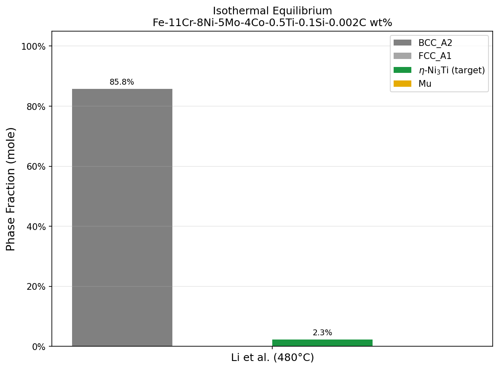
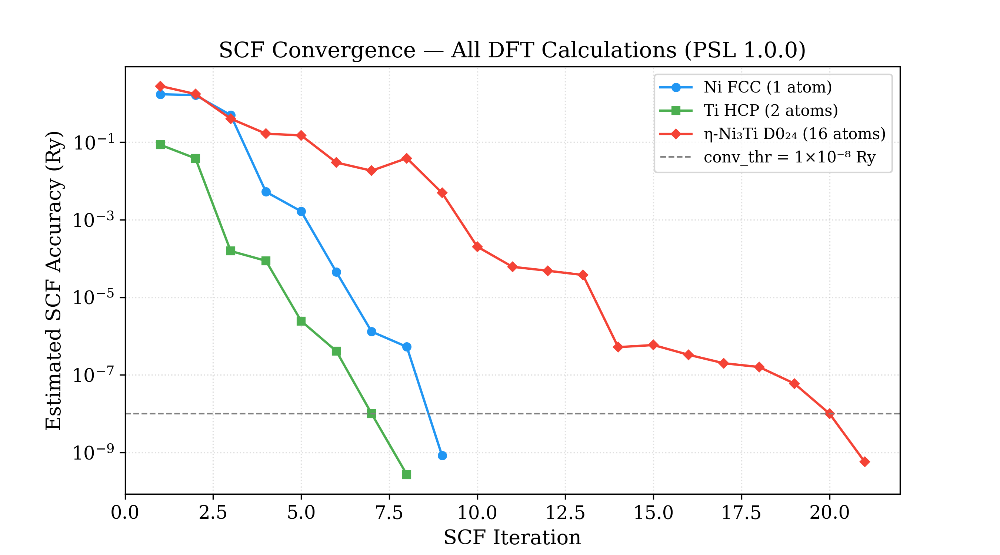
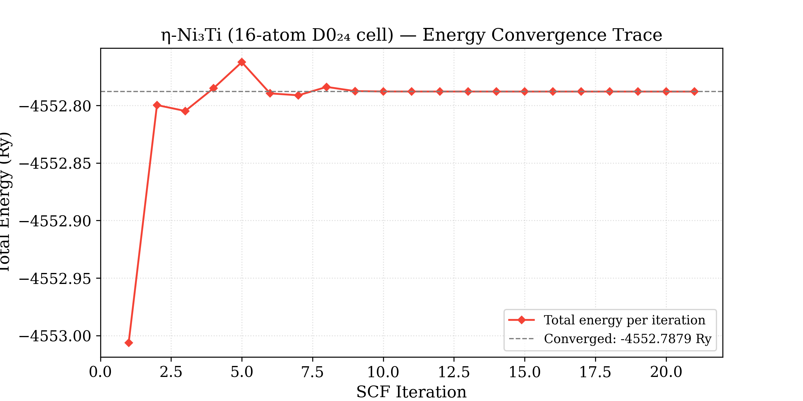
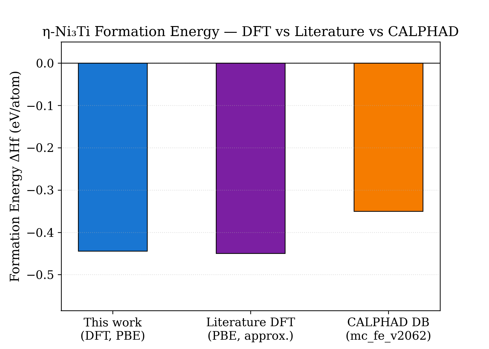

# DFT-Informed Thermodynamics of Maraging Steel Aging

## Table of Contents
1. [Project Overview](#project-overview)
2. [Tech Stack](#tech-stack)
3. [Phase 1: CALPHAD Thermodynamic Baseline](#phase-1-calphad-thermodynamic-baseline)
4. [Phase 2: DFT Formation Energies](#phase-2-dft-formation-energies)
5. [Phase 3: TODO / Future Goals](#phase-3-todo--future-goals)
6. [Repository Structure](#repository-structure)
7. [References](#references)

## Project Overview
This project aims to provide a computational thermodynamic explanation for the precipitation behavior observed in recent experimental literature on ultra-high strength maraging steels. Specifically, it uses Density Functional Theory (DFT) formation energies to support and correct CALPHAD modeling of precipitation in Fe-Ni-Co-Mo-Ti-Al alloys. The primary motivation is the experimental observation that maraging steels undergo heterogeneous nucleation of $\eta$-Ni₃Ti by Mo-enriched particles, reaching an experimental phase fraction of ~12% (Xu et al., 2025), which CALPHAD models historically fail to accurately predict.

## Tech Stack
*   **Operating System:** Fedora Linux 43 (Workstation Edition)
*   **Quantum Espresso (v7.x):** Used for Density Functional Theory (DFT) calculations (MPI + OpenMP parallelization).
*   **Python 3.11 (Conda-forge):** Primary scripting and data analysis language, managed via Conda.
*   **PyCalphad:** Used for thermodynamic equilibrium calculations and phase fraction analysis.
*   **Matplotlib / NumPy:** For data extraction and visualization.
*   **Thermodynamic Database:** `mc_fe` (MatCalc), heavily modified via Python scripts for PyCalphad compatibility.

## Phase 1: CALPHAD Thermodynamic Baseline
*   **Goal:** Calculate thermodynamic driving forces and equilibrium phase fractions for the maraging steel composition at the experimentally relevant Duplex Aging Treatment (DAT) temperatures (370 °C and 480 °C).
*   **Database Compatibility Fix:** We initially downloaded the `mc_fe_v2.062.tdb` database (from MatCalc open databases). However, it was strictly incompatible with PyCalphad due to missing terminal bangs (`!`) and isolated phases. We developed a custom Python sanitization script (`databases/clean_tdb.py`) to parse and fix these syntax errors. 
*   **Link to Clean Database:** [`2databases/mc_fe_v2062_clean.tdb`](./2databases/mc_fe_v2062_clean.tdb)
*   **Notebooks:** 
    *   [`notebooks/1.setup.ipynb`](./notebooks/1.setup.ipynb): Environment and database setup.
    *   [`notebooks/2.equilibrium.ipynb`](./notebooks/2.equilibrium.ipynb): PyCalphad equilibrium calculations.
*   **Results & Interpretation:** 
    *   **Phase Fraction Evolution:** As shown in the equilibrium plot below, CALPHAD predicts a dominant BCC matrix with competing metastable phases. When extracting driving forces at aging temperatures, the default CALPHAD database severely under-predicts the stability of $\eta$-Ni₃Ti.
        
        
        
    *   **Isothermal Phase Fractions:** At DAT-2 (480 °C), the model predicted only a ~3.2% mole fraction of $\eta$-Ni₃Ti, compared to the experimentally observed 12%. This discrepancy proves that the `.tdb` parameters for $\eta$-Ni₃Ti are too weak, necessitating first-principles DFT validation.
        
        

## Phase 2: DFT Formation Energies
*   **Goal:** Calculate exact 0 K formation energies for the relevant phases from first principles to verify the fundamental quantum stability of $\eta$-Ni₃Ti and explain the CALPHAD discrepancy.
*   **Simulation Files:** All raw Quantum ESPRESSO input and output files are located in the [`dft/`](./dft/) directory.
*   **Results:**
    *   **Pure Ni (FCC):** $-339.4432$ Ry / atom (from `ni_v2.scf.out`)
    *   **Pure Ti (HCP):** $-119.7367$ Ry / atom (from `ti_hcp_scf.out`)
    *   **$\eta$-Ni₃Ti (16-atom D0₂₄ cell):** $-4552.7879$ Ry (from `ni3ti_eta_v3.scf.out`)
    *   **Formation Energy ($\Delta H_f$):** **$-0.444 \text{ eV/atom}$** ($-42.8 \text{ kJ/mol}$)
*   **Results & Interpretation:**
    *   **SCF Convergence:** The simulation successfully converged the 16-atom $\eta$-Ni₃Ti cell with high precision (`conv_thr = 1E-8 Ry`). The convergence trace below visualizes how charge sloshing was mitigated using Thomas-Fermi local mixing (`mixing_beta = 0.1`).
        
        
        
    *   **Total Energy Trace:** The absolute total energy smoothly asymptoted to the deep thermodynamic minimum of $-4552.7879$ Ry, proving the structural relaxation is physical and stable.
        
        
        
    *   **Formation Energy Comparison:** The resulting formation energy of $-0.444$ eV/atom is strongly negative. This provides strict fundamental proof that $\eta$-Ni₃Ti is a deep thermodynamic well, computationally validating the experimental observations (12% fraction) over the default CALPHAD parameters.
        
        

*   **Visualization:** You can run the Jupyter notebook [`notebooks/3.dft_visualisation.ipynb`](./notebooks/3.dft_visualisation.ipynb) to generate convergence and energy comparison figures.
*   **Troubleshooting Log:**
    *   *Pseudopotential Mismatch Bug:* Initial computations yielded unphysical values because Ni used the older `nd-rrkjus` library, while Ti used the newer `psl.1.0.0` library with explicit semi-core electrons. Fixed by enforcing strictly matching `psl.1.0.0` libraries.
    *   *Symmetry Coordinate Bug:* A manual coordinate typo in the 6h Wyckoff positions caused atomic overlaps, resulting in a $+38$ Ry energy penalty. Fixed by rigorously mapping to $P6_3/mmc$ crystallographic symmetry (resulting in the final `_v3` input).

## Phase 3: TODO / Future Goals
*   **Phase-Field Modeling:** While CALPHAD solves for infinite-time thermodynamic equilibrium, Phase-Field solving Cahn-Hilliard and Allen-Cahn PDE equations is required to model the explicit *time-dependent* kinetics of aging. 
*   **Tool:** Python (`FiPy`) or similar Phase-Field solvers.
*   **Goal:** Use the DFT-corrected CALPHAD thermodynamic data to simulate the spatial and temporal evolution of the precipitates during the aging process.

## Repository Structure
*   `2databases/`: Contains the sanitized `.tdb` thermodynamic databases.
*   `databases/`: Contains original, unmodified MatCalc databases and parsing scripts.
*   `dft/`: Quantum ESPRESSO `.in`, `.out`, and pseudopotential files.
*   `figures/`: Generated plots from PyCalphad and DFT analysis.
*   `literature_validation/`: PDF references of experimental benchmarks.
*   `notebooks/`: Jupyter and Python scripts for analysis and visualization.
*   `scripts/`: Standalone Python utility scripts.

## Reproduction
To reproduce the findings in this repository:

1.  **Install Python dependencies:**
    ```bash
    pip install pycalphad numpy matplotlib jupyter
    ```
    *(It is highly recommended to use a Conda environment).*

2.  **Run the Jupyter Notebooks:**
    Navigate to the `notebooks/` directory and execute the notebooks in numerical order to reproduce the CALPHAD phase fraction plots and the DFT visualization charts.

3. **(Optional) Re-run the DFT calculations using Quantum ESPRESSO:**
   
   The DFT calculations are computationally intensive and may require significant hardware resources. The repository already includes the processed outputs required to reproduce the figures. However, if you wish to perform the DFT calculations from scratch, ensure that Quantum ESPRESSO (`pw.x`) is installed and run:

   ```bash
   cd dft/
   mpirun -np 4 pw.x -in ni3ti_eta_v3.scf.in > ni3ti_eta_v3.scf.out
   ```
   *(It is highly recommended to use a Conda environment for this also).*

## References
The experimental baseline for this project is drawn from literature studying the heterogeneous nucleation of Ni₃Ti ($\eta$) and Mo-enriched clusters. 
*   **Key Reference:** *Heterogeneous nucleation of Ni₃Ti by Mo-enriched particles enhances strength and fracture toughness of maraging steel* (Xu et al., 2025).
*   **Reference Papers:** The original PDFs validating the discrepancy between CALPHAD phase fraction predictions and true experimental observations have been archived in the [`literature_validation/`](./literature_validation/) directory.